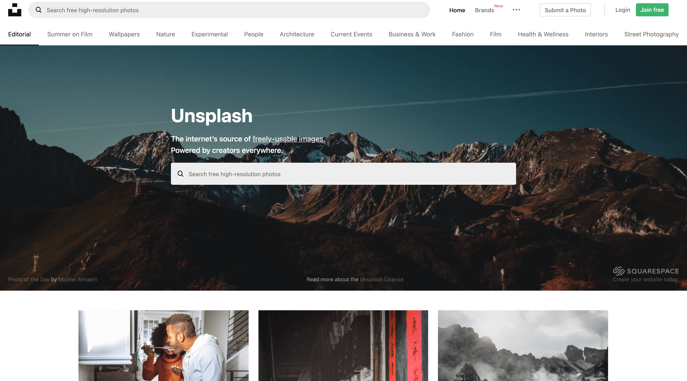
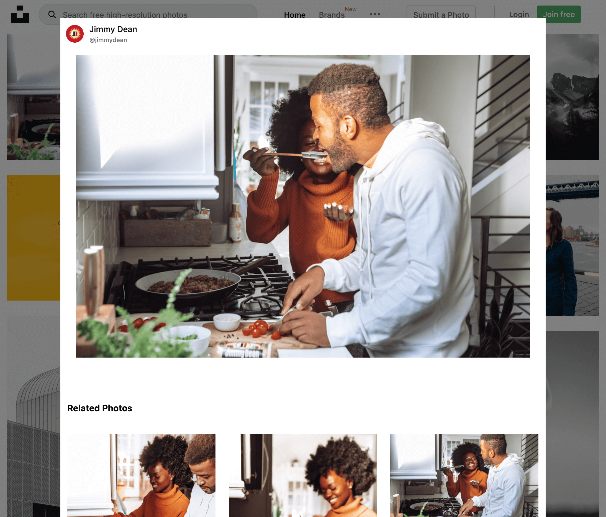
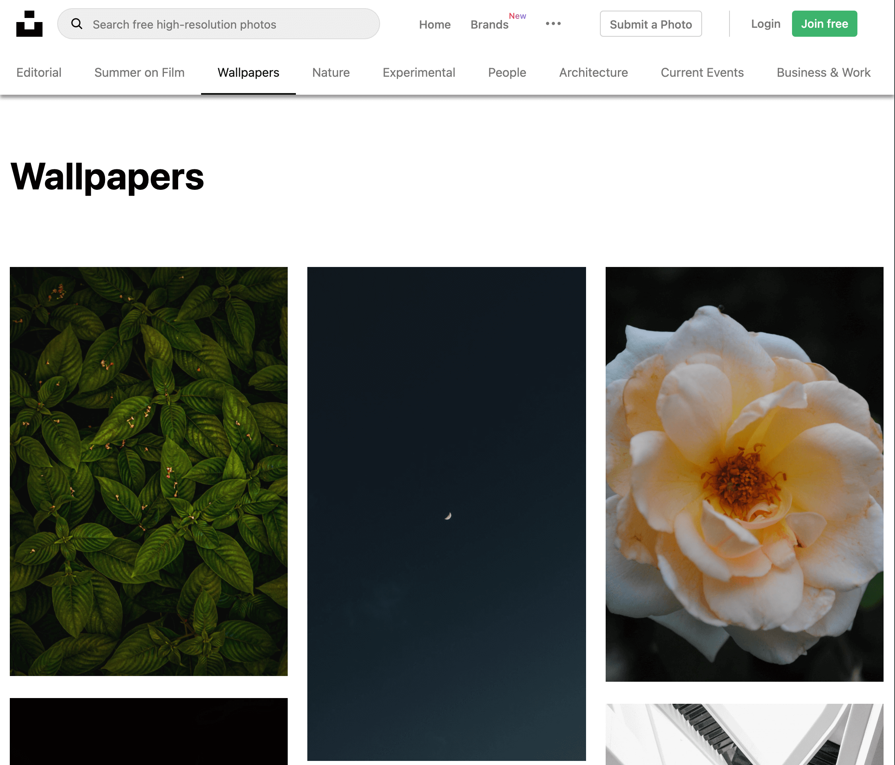
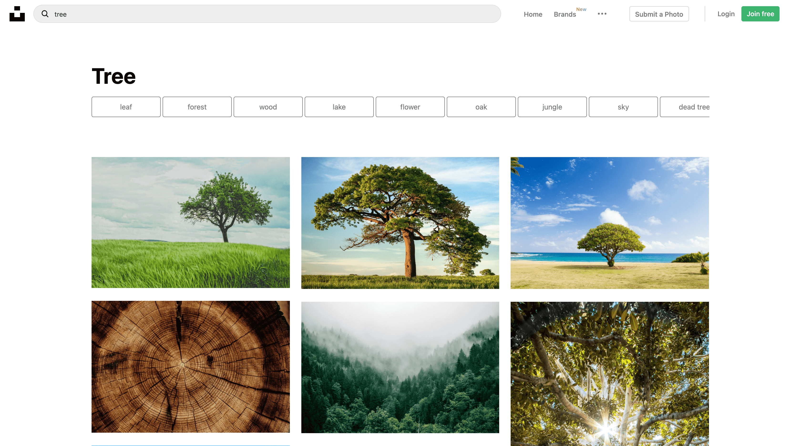
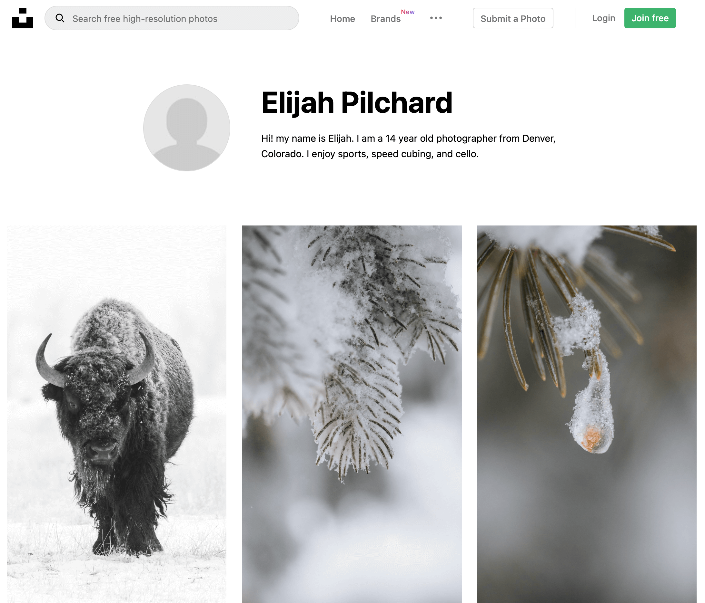

# Unsplash Clone

## 데모
https://festive-mestorf-df1d46.netlify.app/

## 프로젝트 구성안내
### 목표
- unsplash API를 활용해서 유튜브 사이트처럼 만들어보자!
### 간단한 기술 스택
- redux-saga
    - api통신을 할 때 스토어에 데이터를 올려주기 위해 redux미들웨어인 redux-saga사용
    - redux-thunk에 비해 여러가지 기능들이 있다.
    - Generator문법을 사용하는것이 특징이고, 액션을 모니터링하고 있다가 특정 액션이 발생하면 작동한다.
- styled-components
    - 디자인은 기존에 있는 youtube사이트를 보고 만들면 되기때문에 컴포넌트 단위로 스타일을 적용하기 쉽고, props전달도 가능한 styled-components를 선택했다.
- dotenv
  - 외부에 노출되면 안되는 환경변수 관리를 위해 설치  
    ex) API_KEY, APP_ID ....
- netlify
    - 깃에 올리기만 하면 자동 빌드 후 배포해준다
    - 따로 환경변수도 설정이 가능하다.
    - 처음에 등록하는법도 간단하고 쉬워서 선택했다.
    

## 폴더트리 구조
```text
├── src
│   ├── api
│   ├── constants
│   ├── images
│   ├── index.js
│   ├── lib
│   ├── redux
│   │   ├── ActionCreators.js
│   │   ├── app
│   │   │   ├── redux.js
│   │   │   └── saga.js
│   │   ├── collection
│   │   ├── photo
│   │   ├── reducer.js
│   │   ├── saga.js
│   │   ├── store.js
│   │   ├── topic
│   │   └── user
│   ├── styled
│   └── view
│       ├── App.js
│       ├── components
│       │   ├── Button
│       │   ├── Header
│       │   ├── Layout
│       │   ├── MenuPopup
│       │   ├── Messasges
│       │   ├── Photo
│       │   ├── PhotoPopup
│       │   ├── SearchBox
│       │   ├── Spinner
│       │   └── Visual
│       ├── containers
│       │   ├── HeaderContainer
│       │   ├── HomeContainer
│       │   ├── PhotoPopupContainer
│       │   ├── SearchContainer
│       │   ├── TopicContainer
│       │   └── UserContainer
│       ├── pages
│       │   ├── Brands
│       │   ├── Explore
│       │   ├── Home
│       │   ├── Join
│       │   ├── Login
│       │   ├── Oauth
│       │   ├── Search
│       │   ├── Topic
│       │   └── User
│       └── routes
│           └── Routes.js

```
- container에서 props를 가져와서 하위 컴포넌트들에게 필요한 Props를 전달하는 식으로 만들었습니다.

## 프로젝트 설치방법
```shell
# 프로젝트 설치
yarn
```

## 프로젝트 사용법
```shell
# 프로젝트 시작
yarn start
```

## 프로젝트 기능설명
### 메인 페이지

- unsplash 메인 페이지 입니다.
- 기본 사진 목록들이 나오고 사진을 누르면 관련 항목들이 팝업으로 나옵니다.
- 스크롤을 내리면 추가로 이미지들을 더 불러옵니다.
- 상단검색바를 이용하여 원하는 사진을 검색할 수 있습니다.
- 각 토픽 탭을 클릭하여 토픽별로 이미지를 확인 할 수 있습니다.
- 이미지 썸네일에 호버하여 다운로드가 가능하고 로그인 상태면 찜 기능도 가능합니다.
### 이미지 팝업

- 이미지 썸네일을 클릭하면 나오는 팝업입니다.
- 내가 선택한 이미지들이 나오고 아래로는 연관 이미지들이 나옵니다.
- 스크롤을 내리면 추가로 이미지들을 더 불러옵니다.
- 프로필을 클릭하여 프로필 페이지로 이동 가능합니다.
### 토픽 페이지

- 검색 바 밑에 토픽주제별로 클릭하면 나오는 페이지 입니다.
- 이미지 리스트가 나오고 이하 기능은 같습니다.
### 검색 페이지

- 검색결과 페이지 입니다.
- 상단에 연관 검색어들이 나오고 클릭하면 해당 검색어로 이동됩니다.
- 이하 기능은 같습니다.
### 프로필 페이지

- 프로필을 선택했을때 나오는 페이지 입니다.
- 해당 유저가 올린 사진들이 나오고 클릭하면 이미지 관련 팝업이 나옵니다.
- 이하 기능은 같습니다.

## 프로젝트 만들면서..
https://bereal1995.github.io/sideproject/unsplash-clone/

## 저작권 및 사용자 정보
© 2021 HH gygud98@gmail.com
### unsplash api 참고
- https://unsplash.com/documentation#getting-started

## 프로그램 작성자
- https://github.com/bereal1995

## 버전
### 1.0.0 (2021. 03. 15)
- 첫번째 출시